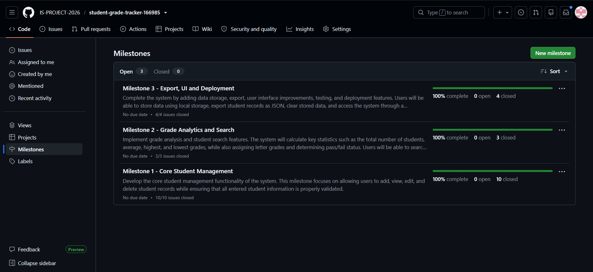
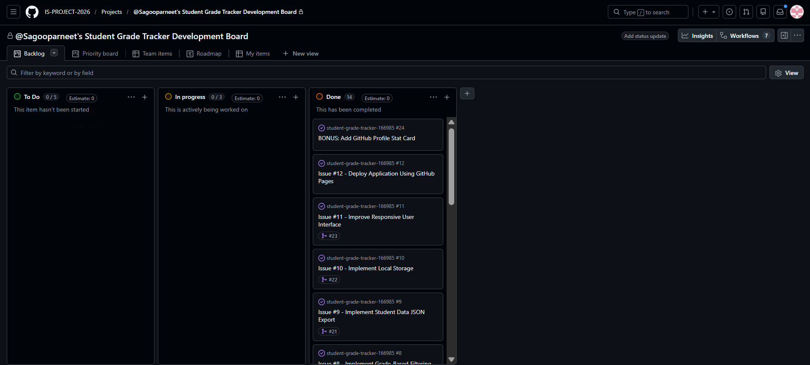
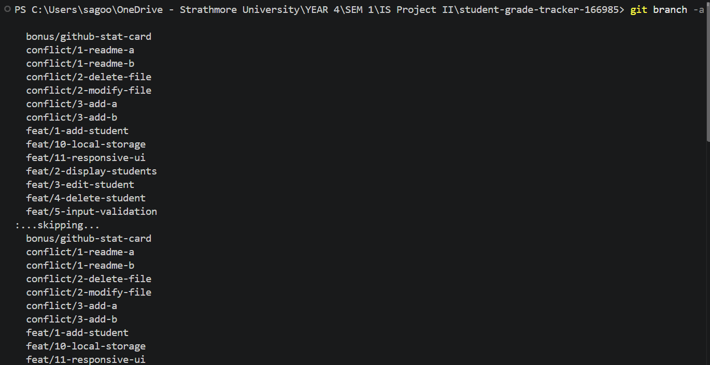
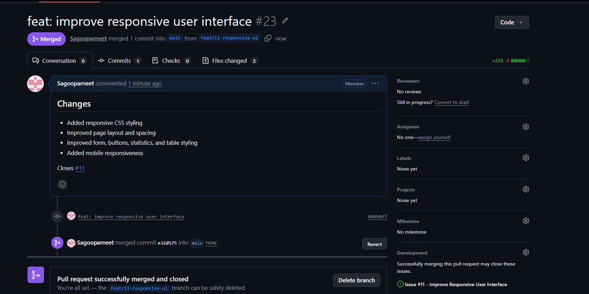
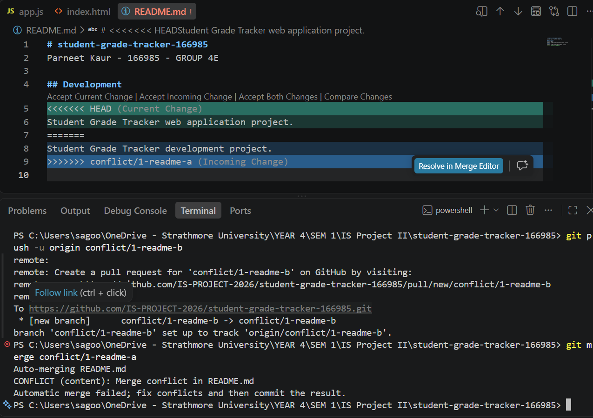
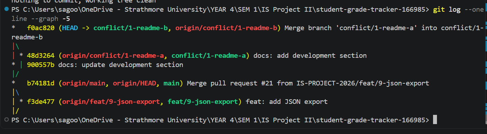
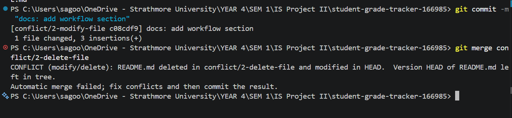
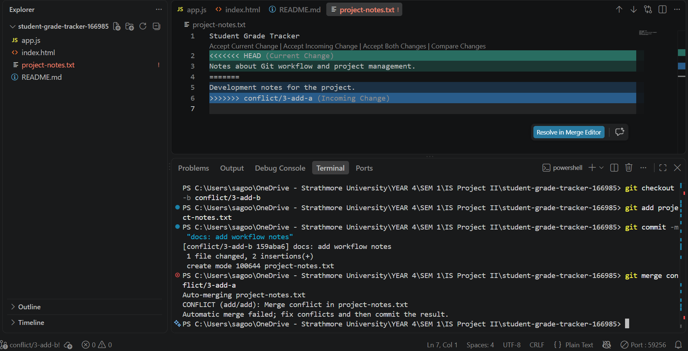

# Project Submission Report

## 1. Student Details

- **Full Name:** Parneet Kaur
- **GitHub Username:** Sagooparneet
- **Email:** parneet.kaur@strathmore.edu

---

## 2. Deployed Project Link

- **Live GitHub Pages URL:** (https://is-project-2026.github.io/student-grade-tracker-166985/)

---

## 3. Reflection — Grounded in Your Git History

> **Rules:** Every answer below **must include a direct link** to the specific commit, PR, issue, or branch in your repository that demonstrates what you are describing. Answers without working links will not be graded. Generic explanations that could apply to any project will receive zero marks.
>
> **Marks:** A (2 marks) · B (1 mark) · C (1 mark) · D (1 mark) = **5 marks total**

### A. Your Best Commit

Paste the URL of the commit in your history that you think best demonstrates clean conventional commit practice (good type tag, clear subject, meaningful body or footer).

- **Commit URL:** https://github.com/IS-PROJECT-2026/student-grade-tracker-166985/commit/66f70eb
- **Why this one?** I chose this commit because it has a clear conventional commit message and focuses on one specific feature, which is calculating the grade statistics.

### B. A Mistake or Struggle

Link to a commit, PR, or issue where something went wrong — a bad commit message you had to fix, a branch you had to delete and recreate, a PR that needed rework, or a deployment that broke. 

- **Link to the evidence:** (https://github.com/IS-PROJECT-2026/student-grade-tracker-166985/commit/f0ac820)
- **What happened and how did you recover?** I encountered a modify/modify merge conflict while working on the README.md file. The `conflict/1-readme-a` and `conflict/1-readme-b` branches both changed the same Development section in different ways, so Git could not automatically merge them. I opened the file in VS Code, reviewed the conflicting changes, selected and combined the appropriate content, and then committed the resolved merge as `f0ac820`.
### C. A Pull Request You're Proud Of

Paste the URL of the PR that best shows your self-review process — one where the description is clear, the issue linkage is correct, and the diff tells a coherent story.

- **PR URL:** (https://github.com/IS-PROJECT-2026/student-grade-tracker-166985/pull/23)
- **What did you check before merging?** I checked that the responsive UI changes were working correctly, that the PR diff was limited to the intended UI improvements, and that the PR description clearly linked to Issue #11 using `Closes #11`. The PR was then merged from `feat/11-responsive-ui` into `main`.

### D. One Thing You Would Do Differently

If you had to restart this project from scratch with everything you know now, name one specific workflow decision you would change (not a code change — a Git/project management decision).

- **What would you change?**  I would create and document the conflict-testing branches earlier instead of introducing them later in the workflow. This would make it easier to organize the three different conflict scenarios and keep their resolution history clearly separated from the main feature developmentier in the project so that the conflict resolution process was easier to organize and document
- **Link to the evidence of the original decision:** https://github.com/IS-PROJECT-2026/student-grade-tracker-166985/commit/48d3264d63c99c8e0f26e173996d9a7915abe11e

---

## 4. Screenshots of Key GitHub Features

Demonstrate your workflow mechanics by embedding your screenshots below.

> **CRITICAL FOR WORKING IMAGES:** Do not type manual folder paths. Edit this file directly on the GitHub web interface, click on the blank line below each prompt, and **paste (Ctrl+V / Cmd+V)** your screenshot. GitHub will automatically upload the file and generate a permanent, working image link for you.

### A. Milestones and Issues
*Provide a screenshot showing your active milestone(s) and the granular tracking issues linked directly to them.*

* **Caption:** The three milestones represent the main stages of development of the Student Grade Tracker. Milestone 1 covers the core student management features, including adding, viewing, editing, deleting, and validating student records. Milestone 2 focuses on grade analytics and student search, including calculating statistics and determining student performance. Milestone 3 covers the final system features such as local data storage, JSON export, UI improvements, testing, and deployment. All associated issues are closed, showing that the planned project functionality was completed.

### B. Project Board
*Provide a screenshot of your GitHub Project Board with your issues organized dynamically across columns (To Do, In Progress, Done).*

* **Caption:** The project board tracks the Student Grade Tracker development workflow using To Do, In Progress, and Done columns. All 14 completed issues are organized under Done, including deployment, responsive UI, local storage, JSON export, and the GitHub profile statistics feature. The cards also show linked pull requests for completed development work, demonstrating traceability between issues and implementation.

### C. Branching Architecture
*Provide a screenshot showing your local or remote Git branch list, highlighting your use of conventional, issue-linked naming patterns (e.g., `feat/`, `fix/`, `style/`).*

* **Caption:** The branch list shows a structured Git workflow using descriptive naming conventions such as feat/ for individual features, bonus/ for additional functionality, and conflict/ branches for controlled merge-conflict testing. The feature branches also include issue numbers, such as feat/11-responsive-ui, making the development work easier to trace back to specific project issues.
### D. Pull Requests & Traceability
*Provide a screenshot of a completed or open Pull Request (PR) on GitHub that clearly shows it is linked to a related development issue.*

* **Caption:** PR #23 shows the complete traceability of the responsive UI feature, linking the feat/11-responsive-ui branch and commit 00db0f7 to Issue #11. The PR description documents the responsive CSS, layout, form, statistics, table, and mobile improvements, and the Closes #11 link confirms that the related development issue was completed when the PR was merged into main.

---

## 5. Merge Conflict Evidence

You must engineer **three merge conflicts**, each triggered by a **different cause** from those covered in the lecture. For Conflict 1, document the full resolution lifecycle. For Conflicts 2 and 3, provide the conflict marker screenshot and identify the cause.

> **Marks:** Conflict 1 full chronology (2 marks) · Conflict 2 (1 mark) · Conflict 3 (1 mark) · All three use distinct causes (1 mark) = **5 marks total**

---

### Conflict 1 — Full Chronology

**What cause did you use?** Modify/Modify conflict

#### Step 1: Generating the Clash

[PASTE SCREENSHOT OF ATTEMPTED MERGE / TERMINAL WARNING HERE]

* **Caption:** The conflict/1-readme-b branch attempted to merge conflict/1-readme-a, but Git detected a content conflict in README.md. Both branches had modified the same Development section with different text, so Git could not automatically determine which version to keep.

#### Step 2: Inside the Code Editor (Conflict Markers)

[PASTE SCREENSHOT OF RAW CONFLICT MARKERS HERE]

* **Caption:** VS Code displays the unresolved README.md conflict using <<<<<<< HEAD, =======, and >>>>>>> conflict/1-readme-a. The current branch describes the project as a web application, while the incoming branch describes it as a development project, so I had to choose and combine the appropriate wording before completing the merge.

#### Step 3: Resolution & Clean Merge

[PASTE SCREENSHOT OF CLEAN RESOLUTION HERE]

* **Caption:** The conflict was successfully resolved and committed as merge commit f0ac820. The Git history shows both conflict/1-readme-a and the original conflict/1-readme-b history joining at the merge commit, confirming that the README conflict was resolved and the working tree was clean.

---

### Conflict 2 — Different Cause

**What cause did you use?** Delete/Modify conflict

**Why does this cause trigger a conflict?** A Delete/Modify conflict occurs when one branch deletes a file while another branch modifies the same file. Git cannot automatically determine whether the file should be removed or whether the modifications should be preserved, so manual resolution is required.

* **Caption:** The merge between conflict/2-modify-file and conflict/2-delete-file produced a Delete/Modify conflict in README.md. The conflict/2-delete-file branch deleted the README while the current branch had modified it, causing Git to stop the merge and require a manual decision.

---

### Conflict 3 — Different Cause

**What cause did you use?** Add/Add conflict

**Why does this cause trigger a conflict?** An Add/Add conflict occurs when two branches independently create a file with the same name and path. Git cannot automatically combine the two different versions because both branches are introducing a new file at the same location.

* **Caption:** The conflict/3-add-b branch and conflict/3-add-a branch independently created project-notes.txt with different content. When the branches were merged, Git detected an add/add conflict and inserted conflict markers because it could not automatically determine which version of the newly created file should be kept.

---

## 6. Feedback & Evaluation

To help improve this course for future engineering cohorts, please take 2 minutes to fill out the anonymous feedback form. Your honest review helps shape how this program is taught next semester!
- [ ] **Anonymous Evaluation Form:** [Course & Instructor Evaluation](https://forms.gle/YLybnsyXXErKEg3s9)

---
 
## Final Submission
 
Once your repository is complete, submit your work through the official submission form below. The form will **stop accepting responses after Monday, August 17th, 2026** — no late submissions will be accepted.
 
> **Submission Form:** [https://forms.gle/KrT4VxtFtkU3wtYu8](https://forms.gle/KrT4VxtFtkU3wtYu8)
